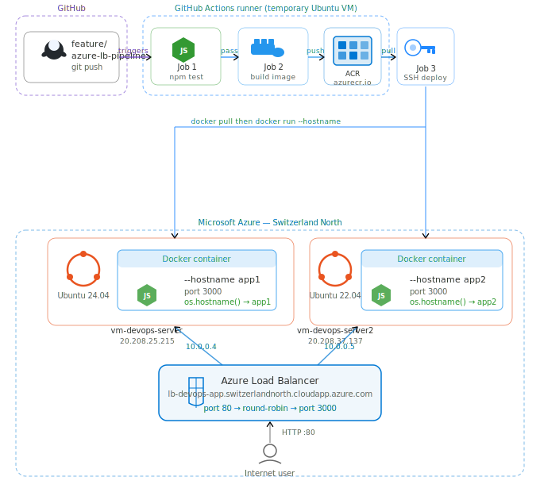

# Azure-Native-CICD-Load-Balanced-App

**Part 2 of 2** | [Part 1: Docker-CICD-Load-Balanced-App](https://github.com/Adewoleshittabey/Docker-CICD-Load-Balanced-App)

A fully Azure-native CI/CD pipeline that automatically tests, builds, and deploys a Node.js web application to two separate Azure Virtual Machines behind an Azure Load Balancer — triggered by every feature branch push to GitHub.

---

## Architecture



---

## How It Works

1. Developer pushes code to the `feature/azure-lb-pipeline` branch
2. **GitHub Actions** triggers automatically on GitHub's servers
3. **Job 1 — Test:** runs `npm test`. Pipeline stops if tests fail
4. **Job 2 — Build & Push:** builds a Docker image and pushes it to Azure Container Registry
5. **Job 3 — Deploy:** SSHs into both Azure VMs, pulls the image from ACR, runs the container with the correct hostname
6. **Azure Load Balancer** health probes confirm both VMs are healthy
7. Traffic is distributed between VM1 (app1) and VM2 (app2) in round-robin
```
curl http://lb-devops-app.switzerlandnorth.cloudapp.azure.com
Hi there! I'm being served from app1

curl http://lb-devops-app.switzerlandnorth.cloudapp.azure.com
Hi there! I'm being served from app2
```

---

## Live Application

**Load Balancer:** http://lb-devops-app.switzerlandnorth.cloudapp.azure.com

---

## Technology Stack

| Technology | Role |
|---|---|
| GitHub Actions | CI/CD pipeline — 3 jobs: test, build, deploy |
| Docker | Containerises the Node.js application |
| Azure Container Registry | Stores Docker image — built once, deployed to both VMs |
| Azure Load Balancer | Distributes traffic between VM1 and VM2 (round-robin) |
| Azure Virtual Machines | Two separate servers — VM1 runs app1, VM2 runs app2 |
| Azure CLI | All infrastructure provisioned as code |
| Node.js | The web application runtime |
| Ubuntu Linux | OS on both VMs (24.04 on VM1, 22.04 on VM2) |

---

## How Part 2 Differs from Part 1

| Component | Part 1 (Docker-CICD) | Part 2 (This repo) |
|---|---|---|
| Load Balancer | Nginx software container | Azure Load Balancer (managed service) |
| App Servers | 2 containers on 1 VM | 2 separate Azure VMs |
| Image Registry | None — built on VM each time | Azure Container Registry |
| Image Build | Rebuilt on each VM separately | Built once, stored centrally in ACR |
| Provisioning | Docker Compose | Azure CLI (Infrastructure as Code) |
| Health Checking | Basic container restart | HTTP health probes every 15 seconds |
| Failover | Manual | Automatic — unhealthy VMs removed instantly |

---

## Azure Resources

| Resource | Name | Address |
|---|---|---|
| Container Registry | devopsacrregistry | devopsacrregistry.azurecr.io |
| VM1 | vm-devops-server (Ubuntu 24.04) | 20.208.25.215 |
| VM2 | vm-devops-server2 (Ubuntu 22.04) | 20.208.37.137 |
| Load Balancer | lb-devops | 20.203.176.121 |
| Load Balancer DNS | lb-devops-app | lb-devops-app.switzerlandnorth.cloudapp.azure.com |
| Resource Group | rg-devops-project | Switzerland North |

---

## Pipeline Jobs

### Job 1: Test
Runs on a GitHub-hosted Ubuntu runner. Installs Node.js 18, runs `npm install` and `npm test`. If tests fail the pipeline stops — nothing is built or deployed.

### Job 2: Build and Push
Logs into Azure Container Registry, builds the Docker image, and pushes it as `devopsacrregistry.azurecr.io/app:latest`. The image is built once and used by both VMs — guaranteeing identical deployments.

### Job 3: Deploy
SSHs into VM1 and VM2 separately. On each VM:
- Logs into ACR
- Pulls the latest image
- Stops and removes the existing container
- Runs a fresh container with `--hostname app1` or `--hostname app2`

The hostname flag is what makes each VM return a different name in the response — the Node.js app reads `os.hostname()` at runtime.

---

## GitHub Secrets Required

| Secret | Purpose |
|---|---|
| `ACR_USERNAME` | Azure Container Registry username |
| `ACR_PASSWORD` | Azure Container Registry password |
| `VM1_HOST` | VM1 public IP for SSH |
| `VM1_SSH_KEY` | VM1 private SSH key |
| `VM2_HOST` | VM2 public IP for SSH |
| `VM2_SSH_KEY` | VM2 private SSH key |
| `LB_HOST` | Load Balancer DNS for pipeline verification |

---

## Running the Application Locally
```bash
git clone https://github.com/Adewoleshittabey/Azure-Native-CICD-Load-Balanced-App.git
cd Azure-Native-CICD-Load-Balanced-App
npm install
npm test
npm start
# Visit http://localhost:3000
```

---

## Key Learnings and Troubleshooting

### Two-layer firewall on Azure VMs
Azure VMs have two separate firewall layers: the **Azure Network Security Group** (outer) and **Ubuntu iptables** (inner). Both must allow a port for traffic to reach a container. Port 3000 was open in iptables but blocked by the NSG — the Azure Load Balancer health probes could not reach the app, so both VMs were marked unhealthy. Fixed by adding an NSG inbound rule via Azure CLI.

### Azure Load Balancer distribution
Azure Load Balancer uses 5-tuple hash distribution by default (source IP, source port, destination IP, destination port, protocol) rather than strict sequential round-robin. In production with real users from different IPs, distribution is naturally balanced across both VMs.

---

## Author

Adewole Shitta Bey
